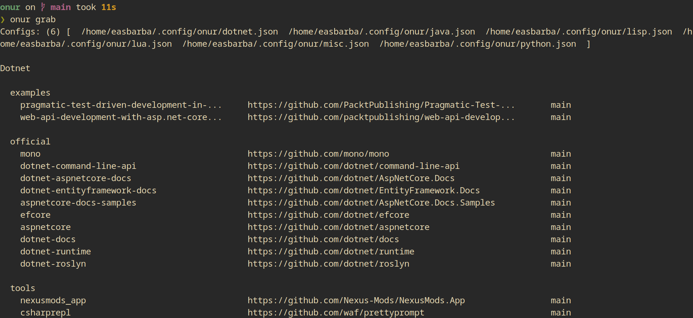

<!--
Onur is free software: you can redistribute it and/or modify
it under the terms of the GNU General Public License as published by
the Free Software Foundation, either version 3 of the License, or
(at your option) any later version.

Onur is distributed in the hope that it will be useful,
but WITHOUT ANY WARRANTY; without even the implied warranty of
MERCHANTABILITY or FITNESS FOR A PARTICULAR PURPOSE.  See the
GNU General Public License for more details.

You should have received a copy of the GNU General Public License
along with Onur. If not, see <https://www.gnu.org/licenses/>.
-->

# Onur.net

Easily manage multiple FLOSS repositories.
[c](https://gitlab.com/easbarba/onur) | [go](https://gitlab.com/easbarba/onur-go) | [python](https://gitlab.com/easbarba/onur-python) | [rust](https://gitlab.com/easbarba/onur-rust) | [php](https://gitlab.com/easbarba/onur-php) | [java](https://gitlab.com/easbarba/onur-java) 

# Installation

## Usage

`Onur` consumes configurations files at `$XDG_CONFIG/onur`.

```json
onur grab
onur archive nuxt,awesomewm,guzzle
onur grab --file /path/to/custom/config
onur --help
```

- `$ONUR_CONFIG_HOME` environment variable is available to define a new location of configuration files.
- repositories are stored in the `$HOME/Projects` folder.

## CONFIGURATION FILE

A `onur` single configuration file:

```json
{
  "main": [
    {
      "name": "awesomewm",
      "url": "https://github.com/awesomeWM/awesome"
    },
    {
      "name": "nuxt",
      "branch": "main",
      "url": "https://github.com/nuxt/framework"
    }
  ],
  "misc": [
    {
      "name": "awesomewm",
      "url": "https://github.com/awesomeWM/awesome"
    },
    {
      "name": "nuxt",
      "branch": "main",
      "url": "https://github.com/nuxt/framework"
    }
  ],
  "tools/gnu": [
    {
      "name": "inetutils",
      "url": "https://git.savannah.gnu.org/git/inetutils.git"
    },
    {
      "name": "gnu-wget",
      "url": "https://git.savannah.gnu.org/git/wget.git"
    }
  ]
}
```

More examples of configuration files are at `examples`.

## SETTINGS

```toml
[git]
single-branch = true
quiet = true
depth = 1
```

## DEVELOPMENT

In development it may suit you better running the tests in a isolated environment
with containers, that can be done so:

    docker run --rm -it $(docker build -qf Containerfile.run)
 
or: 

    podman build https://gitlab.com/easbarba/onur/-/raw/main/Containerfile.dev --tag onur:latest
    podman run --rm -it onur:latest 




## LICENSE

[GNU GENERAL PUBLIC LICENSE Version 3](https://www.gnu.org/licenses/gpl-3.0.en.html)
